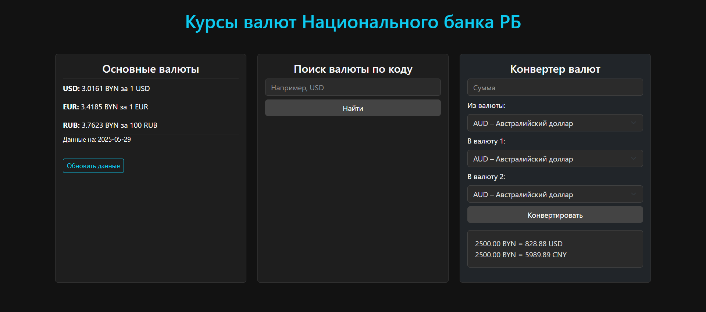

# Курсы валют Национального банка РБ



🔗 **Делой:** [https://exchange-rates-ogdd.onrender.com](https://exchange-rates-ogdd.onrender.com)  
📁 **GitHub репозиторий:** [https://github.com/pvlbrzn/Exchange_rates](https://github.com/pvlbrzn/Exchange_rates)

## Описание проекта

Приложение для получения и конвертации курсов валют Национального банка Республики Беларусь с использованием официального API.

## Стек технологий

* Python 3
* Flask
* HTML/CSS + Bootstrap 5
* Jinja2
* requests
* Docker

## Установка зависимостей

Клонируйте репозиторий:
```bash
https://github.com/pvlbrzn/Exchange_rates.git
cd Exchange_rates
```

Создайте виртуальное окружение и активируйте его:
```bash
python -m venv .venv
source .venv/bin/activate  # для Linux/macOS
.venv\Scripts\activate   # для Windows
pip install -r requirements.txt
```

Установите зависимости:
```bash
python -m venv venv
source venv/bin/activate      # для Linux/macOS
venv\Scripts\activate         # для Windows
```

## Запуск приложения локально

```bash
python app.py
```

### С помощью Docker:

```bash
docker build -t exchange-flask-app .
docker run -p 5000:5000 exchange-flask-app
```

Приложение будет доступно по адресу: [http://127.0.0.1:5000](http://127.0.0.1:5000)

## Архитектура приложения

* `app.py` — основной Flask-файл с маршрутами
* `api.py` — модуль для запросов к АПИ НБРБ
* `converter.py` — логика конвертации валют
* `templates/` — HTML-шаблоны (вторичные наследуют base.html)
* `static/` — CSS, изображения
* `Dockerfile`  — Создаёт образ для запуска Flask-приложения
* `requirements.txt`  — Список зависимостей (Flask, requests и др.)
* `README.md`  — Инструкция по установке и запуску


## Ссылка на деплой (Render)

[Открыть приложение](https://your-render-url.onrender.com)

## Лицензия

Этот проект распространяется под MIT License.
